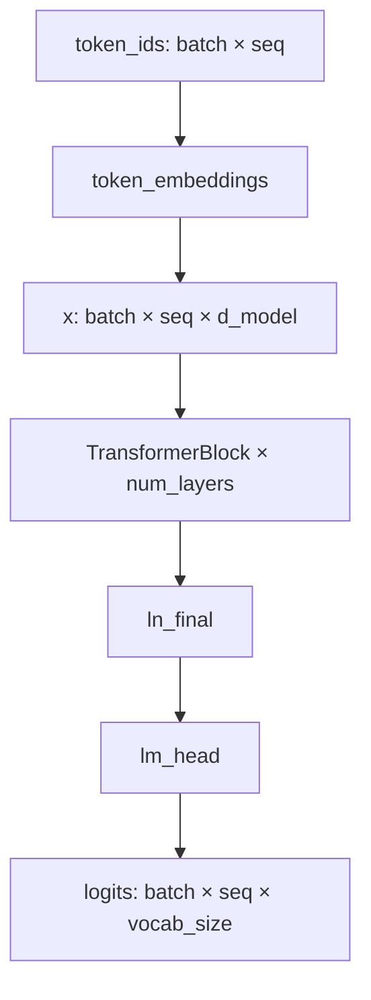

# Transformer Language Model Architecture

This package implements the model components for CS336 Assignment 1. The
architecture is a decoder-only Transformer language model with pre-norm
Transformer blocks, RoPE positional information, causal multi-head
self-attention, SwiGLU feed-forward layers, RMSNorm, and a final vocabulary
projection.

## Module Layout

- `linear.py`
  - Implements a bias-free linear layer.
  - Stores weights with shape `(out_features, in_features)`.
  - Applies the projection over the final input dimension.
- `embedding.py`
  - Implements token embedding lookup.
  - Maps token IDs with shape `...` to embeddings with shape
    `... embedding_dim`.
- `rmsnorm.py`
  - Implements RMSNorm over the final dimension.
  - Performs normalization in `float32`, then casts back to the input dtype.
- `swiglu.py`
  - Implements the SwiGLU feed-forward network.
  - Uses three projections named `w1`, `w2`, and `w3` to match the assignment
    reference state dict.
- `rope.py`
  - Implements rotary positional embeddings.
  - Precomputes non-trainable sine and cosine buffers.
  - Applies rotation to query and key vectors per attention head.
- `softmax.py`
  - Implements numerically stable softmax.
- `attention.py`
  - Implements scaled dot-product attention.
  - Implements causal multi-head self-attention with optional RoPE.
- `transformer_block.py`
  - Implements one pre-norm Transformer block.
  - Uses residual connections around both attention and feed-forward sublayers.
- `transformer_lm.py`
  - Implements the full decoder-only Transformer language model.
  - Produces vocabulary logits from token IDs.

## Public API

The package exports the main building blocks through `cs336_basics.model`:

```python
from cs336_basics.model import (
    Embedding,
    Linear,
    MultiHeadSelfAttention,
    RMSNorm,
    RotaryPositionalEmbedding,
    SwiGLU,
    TransformerBlock,
    TransformerLM,
    scaled_dot_product_attention,
    silu,
    softmax,
)
```

Construct a language model:

```python
from cs336_basics.model import TransformerLM

model = TransformerLM(
    vocab_size=50_257,
    context_length=1_024,
    d_model=1_600,
    num_layers=48,
    num_heads=25,
    d_ff=4_288,
    rope_theta=10_000.0,
)

logits = model(token_ids)  # token_ids: (batch, seq_len)
```

## Shape Conventions

Most modules operate on the final dimension and preserve all leading batch
dimensions.

- Linear:
  - Input: `(..., in_features)`
  - Weight: `(out_features, in_features)`
  - Output: `(..., out_features)`
- Embedding:
  - Input token IDs: `(...)`
  - Weight: `(num_embeddings, embedding_dim)`
  - Output: `(..., embedding_dim)`
- RMSNorm:
  - Input: `(..., d_model)`
  - Output: `(..., d_model)`
- RoPE:
  - Input query/key: `(..., seq_len, d_k)`
  - Token positions: `(..., seq_len)` or `(seq_len,)`
  - Output: `(..., seq_len, d_k)`
- Multi-head self-attention:
  - Input: `(..., seq_len, d_model)`
  - Internal Q/K/V after head split: `(..., num_heads, seq_len, d_k)`
  - Output: `(..., seq_len, d_model)`
- TransformerLM:
  - Input token IDs: `(batch, seq_len)`
  - Output logits: `(batch, seq_len, vocab_size)`

## Forward Pass Data Flow



One Transformer block uses the pre-norm residual structure:

```python
x = x + attn(ln1(x), token_positions)
x = x + ffn(ln2(x))
```

This is intentionally not post-norm. The normalization happens before each
sublayer, and each sublayer output is added back to its input.

## Multi-Head Self-Attention

The Q, K, and V projections each map from `d_model` to `d_model`. The result is
then reshaped into `num_heads` separate heads:

```text
... seq d_model -> ... num_heads seq d_k
```

where:

```text
d_k = d_model / num_heads
```

The causal attention computation is:

```text
scores = QK^T / sqrt(d_k)
weights = softmax(mask(scores))
output = weights V
```

The causal mask is lower triangular, so token `i` can attend only to positions
`<= i`. RoPE, when enabled, is applied only to Q and K, not to V.

## SwiGLU Feed-Forward Layer

The feed-forward layer follows:

```python
ffn(x) = w2(silu(w1(x)) * w3(x))
```

The assignment state dict expects the projection names `w1`, `w2`, and `w3`.
Those names are kept even though more descriptive alternatives like
`gate_proj`, `down_proj`, and `up_proj` would also be common in production code.

## Trainable Parameters

RoPE and softmax have no trainable parameters. For this architecture, assuming
the token embedding and `lm_head` weights are not tied, the parameter count is:

```text
token embedding: vocab_size × d_model
per layer attention: 4 × d_model²
per layer SwiGLU: 3 × d_model × d_ff
per layer RMSNorm: 2 × d_model
final RMSNorm: d_model
lm_head: d_model × vocab_size
```

Total:

```text
2 × vocab_size × d_model
+ num_layers × (4 × d_model² + 3 × d_model × d_ff + 2 × d_model)
+ d_model
```

## Matrix-Multiply FLOPs

For a sequence length `T` and batch size `B = 1`, counting a multiply-add as
2 FLOPs:

```text
Q/K/V/O projections: num_layers × 8 × T × d_model²
attention QK^T:      num_layers × 2 × T² × d_model
attention AV:        num_layers × 2 × T² × d_model
SwiGLU FFN:          num_layers × 6 × T × d_model × d_ff
lm_head:             2 × T × d_model × vocab_size
```

For batch size `B`, multiply these terms by `B`.

The attention score and weighted-sum terms scale as `T²`, while projections and
FFN scale linearly in `T`. For long contexts, dense attention is therefore
dominated by `QK^T` and `AV`.

## State Dict Naming

Names are chosen to match the assignment reference implementation:

- `token_embeddings.weight`
- `layers.N.ln1.weight`
- `layers.N.attn.q_proj.weight`
- `layers.N.attn.k_proj.weight`
- `layers.N.attn.v_proj.weight`
- `layers.N.attn.output_proj.weight`
- `layers.N.ln2.weight`
- `layers.N.ffn.w1.weight`
- `layers.N.ffn.w2.weight`
- `layers.N.ffn.w3.weight`
- `ln_final.weight`
- `lm_head.weight`

Because these names correspond to registered submodules and parameters, tests
load reference weights with `load_state_dict(...)`.

## Implementation Invariants

- Linear layers are bias-free.
- `d_model` must be divisible by `num_heads`.
- RoPE requires an even `d_k`, because dimensions are rotated in pairs.
- RoPE buffers are registered with `persistent=False`; they move with the module
  across devices but are not saved as trainable state.
- RMSNorm normalizes only over the final dimension.
- Causal self-attention masks future positions.
- Residual connections are applied around both attention and feed-forward
  sublayers.
- The final model returns logits, not probabilities.

## Tests

Run the model-related tests:

```bash
uv run pytest -q tests/test_model.py
```

During local development in this repository, the virtual environment command is
also available:

```bash
.venv/bin/pytest -q tests/test_model.py
```
