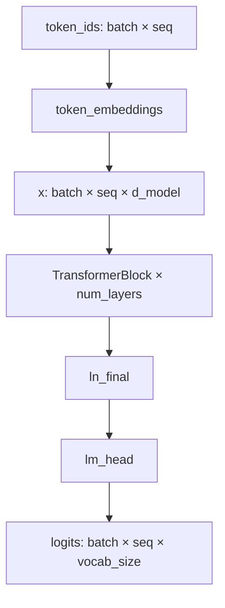

# Transformer 语言模型架构

本包实现 CS336 Assignment 1 的模型组件。整体架构是 decoder-only Transformer 语言模型，包含 pre-norm Transformer block、RoPE 位置信息、因果多头自注意力、SwiGLU 前馈层、RMSNorm，以及最终词表投影。

## 模块结构

- `linear.py`
  - 实现无 bias 的线性层。
  - 权重形状为 `(out_features, in_features)`。
  - 在线性输入的最后一维上做投影。
- `embedding.py`
  - 实现 token embedding lookup。
  - 将形状为 `...` 的 token ID 映射到形状为 `... embedding_dim` 的 embedding。
- `rmsnorm.py`
  - 在最后一维上实现 RMSNorm。
  - 使用 `float32` 做归一化，再转换回输入 dtype。
- `swiglu.py`
  - 实现 SwiGLU 前馈网络。
  - 使用 `w1`、`w2`、`w3` 三个投影名，以匹配作业参考 state dict。
- `rope.py`
  - 实现 rotary positional embedding。
  - 预先计算不可训练的 sine 和 cosine buffer。
  - 对每个 attention head 的 query 和 key 做旋转。
- `softmax.py`
  - 实现数值稳定的 softmax。
- `attention.py`
  - 实现 scaled dot-product attention。
  - 实现可选 RoPE 的因果多头自注意力。
- `transformer_block.py`
  - 实现一个 pre-norm Transformer block。
  - 在 attention 和 feed-forward 子层外使用 residual connection。
- `transformer_lm.py`
  - 实现完整 decoder-only Transformer LM。
  - 从 token ID 输出词表 logits。

## 公共 API

主要模块通过 `cs336_basics.model` 导出：

```python
from cs336_basics.model import (
    Embedding,
    Linear,
    MultiHeadSelfAttention,
    RMSNorm,
    RotaryPositionalEmbedding,
    SwiGLU,
    TransformerBlock,
    TransformerLM,
    scaled_dot_product_attention,
    silu,
    softmax,
)
```

构造语言模型：

```python
from cs336_basics.model import TransformerLM

model = TransformerLM(
    vocab_size=50_257,
    context_length=1_024,
    d_model=1_600,
    num_layers=48,
    num_heads=25,
    d_ff=4_288,
    rope_theta=10_000.0,
)

logits = model(token_ids)  # token_ids: (batch, seq_len)
```

## Shape 约定

多数模块都在最后一维上操作，并保留所有前置 batch 维度。

- Linear:
  - 输入: `(..., in_features)`
  - 权重: `(out_features, in_features)`
  - 输出: `(..., out_features)`
- Embedding:
  - 输入 token IDs: `(...)`
  - 权重: `(num_embeddings, embedding_dim)`
  - 输出: `(..., embedding_dim)`
- RMSNorm:
  - 输入: `(..., d_model)`
  - 输出: `(..., d_model)`
- RoPE:
  - 输入 query/key: `(..., seq_len, d_k)`
  - Token positions: `(..., seq_len)` 或 `(seq_len,)`
  - 输出: `(..., seq_len, d_k)`
- Multi-head self-attention:
  - 输入: `(..., seq_len, d_model)`
  - Q/K/V 拆分 head 后: `(..., num_heads, seq_len, d_k)`
  - 输出: `(..., seq_len, d_model)`
- TransformerLM:
  - 输入 token IDs: `(batch, seq_len)`
  - 输出 logits: `(batch, seq_len, vocab_size)`

## 前向传播数据流



单个 Transformer block 使用 pre-norm residual 结构：

```python
x = x + attn(ln1(x), token_positions)
x = x + ffn(ln2(x))
```

这里刻意不是 post-norm。归一化发生在每个子层之前，子层输出再加回输入。

## 多头自注意力

Q、K、V 投影都从 `d_model` 映射到 `d_model`，随后 reshape 成 `num_heads` 个独立 head：

```text
... seq d_model -> ... num_heads seq d_k
```

其中：

```text
d_k = d_model / num_heads
```

因果 attention 计算为：

```text
scores = QK^T / sqrt(d_k)
weights = softmax(mask(scores))
output = weights V
```

因果 mask 是下三角矩阵，因此 token `i` 只能 attend 到位置 `<= i`。启用 RoPE 时，只对 Q 和 K 应用 RoPE，不对 V 应用。

## SwiGLU 前馈层

前馈层形式：

```python
ffn(x) = w2(silu(w1(x)) * w3(x))
```

作业参考 state dict 期望投影名称为 `w1`、`w2` 和 `w3`。这些名称保留下来，即使生产代码里也常见 `gate_proj`、`down_proj`、`up_proj` 等更描述性的命名。

## 可训练参数

RoPE 和 softmax 没有可训练参数。假设 token embedding 和 `lm_head` 权重不共享，本架构参数量为：

```text
token embedding: vocab_size × d_model
per layer attention: 4 × d_model²
per layer SwiGLU: 3 × d_model × d_ff
per layer RMSNorm: 2 × d_model
final RMSNorm: d_model
lm_head: d_model × vocab_size
```

总计：

```text
2 × vocab_size × d_model
+ num_layers × (4 × d_model² + 3 × d_model × d_ff + 2 × d_model)
+ d_model
```

## 矩阵乘 FLOPs

对序列长度 `T` 和 batch size `B = 1`，若一次 multiply-add 记为 2 FLOPs：

```text
Q/K/V/O projections: num_layers × 8 × T × d_model²
attention QK^T:      num_layers × 2 × T² × d_model
attention AV:        num_layers × 2 × T² × d_model
SwiGLU FFN:          num_layers × 6 × T × d_model × d_ff
lm_head:             2 × T × d_model × vocab_size
```

对于 batch size `B`，将这些项乘以 `B`。

Attention score 和 weighted-sum 项随 `T²` 增长，而 projection 和 FFN 随 `T` 线性增长。长上下文下，dense attention 通常主要由 `QK^T` 和 `AV` 主导。

## State Dict 命名

命名选择用于匹配作业参考实现：

- `token_embeddings.weight`
- `layers.N.ln1.weight`
- `layers.N.attn.q_proj.weight`
- `layers.N.attn.k_proj.weight`
- `layers.N.attn.v_proj.weight`
- `layers.N.attn.output_proj.weight`
- `layers.N.ln2.weight`
- `layers.N.ffn.w1.weight`
- `layers.N.ffn.w2.weight`
- `layers.N.ffn.w3.weight`
- `ln_final.weight`
- `lm_head.weight`

这些名称来自已注册的子模块和参数，因此测试可以用 `load_state_dict(...)` 加载参考权重。

## 实现不变量

- Linear 层没有 bias。
- `d_model` 必须能被 `num_heads` 整除。
- RoPE 要求 `d_k` 为偶数，因为旋转按维度对进行。
- RoPE buffer 使用 `persistent=False` 注册；它们会随模块移动设备，但不会作为可训练状态保存。
- RMSNorm 只在最后一维归一化。
- 因果 self-attention 会 mask 未来位置。
- Attention 和 feed-forward 子层外都使用 residual connection。
- 最终模型返回 logits，而不是 probabilities。

## 测试

运行模型相关测试：

```bash
uv run pytest -q tests/test_model.py
```

在本仓库本地开发时，也可以使用虚拟环境中的命令：

```bash
.venv/bin/pytest -q tests/test_model.py
```
