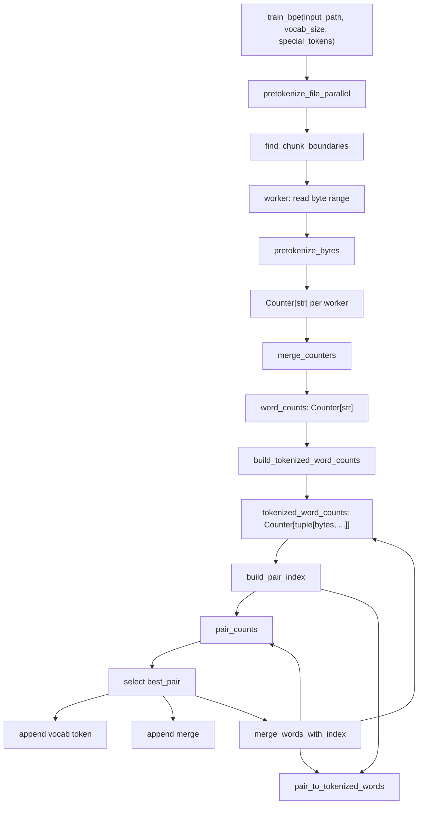

# Tokenizer BPE Design

This package implements byte-pair encoding (BPE) tokenizer training for CS336
Assignment 1. The public entry point remains `train_bpe` in `train_bpe.py`, while
the implementation is split into focused modules for pre-tokenization and BPE
merge training.

## Module Layout

- `train_bpe.py`
  - Validates the requested vocabulary size.
  - Runs file pre-tokenization.
  - Trains BPE from the resulting pretoken counts.
- `pretokenization.py`
  - Splits raw bytes around special tokens.
  - Applies the GPT-2 pre-tokenization regex.
  - Supports multiprocessing over file chunks separated by special-token
    boundaries.
- `bpe.py`
  - Builds the initial byte vocabulary.
  - Converts pretokens to byte-symbol tuples.
  - Maintains pair counts and an inverted index from pairs to affected tokenized
    words.
  - Applies BPE merges deterministically.

## Data Flow

## Pre-Tokenization

`pretokenize_file_parallel` accepts an optional `num_processes` keyword through
`train_bpe(..., num_processes=N)`. If omitted, it uses up to 8 local CPUs.

The parallel path:

- Encodes special tokens as bytes.
- Uses the longest special token as the chunk-boundary marker.
- Has each worker open the file, seek to its assigned byte range, and return a
  local `Counter[str]`.
- Merges worker counters in the parent process.

Fallbacks:

- `num_processes <= 1` runs single-process pre-tokenization.
- No special tokens runs single-process pre-tokenization, because arbitrary byte
  boundaries can change regex behavior at chunk edges.
- If chunk-boundary discovery collapses to one chunk, it also runs
  single-process pre-tokenization.

## BPE Training

The trainer starts from:

- `vocab`: all 256 single-byte tokens followed by special tokens.
- `tokenized_word_counts`: `Counter[tuple[bytes, ...]]`, mapping each pretoken's
  byte-symbol sequence to its corpus frequency.
- `pair_counts`: weighted counts of adjacent byte-symbol pairs.
- `pair_to_tokenized_words`: an inverted index from each pair to the set of
  tokenized words that currently contain it.

Each merge iteration:

1. Selects the best pair by `(frequency, pair)`.
2. Appends the merged byte token to `vocab`.
3. Appends the selected pair to `merges`.
4. Rewrites only tokenized words containing that pair.
5. Decrements old pair counts and increments new pair counts for those affected
   tokenized words.

This avoids recomputing adjacent pair counts from the full word counter on every
merge.

## Key Data Structures

- `word_counts`: `Counter[str]`
  - Maps each pretokenized string to its frequency in the corpus.
- `tokenized_word_counts`: `Counter[tuple[bytes, ...]]`
  - Maps each byte-symbol sequence to its frequency.
- `pair_counts`: `Counter[tuple[bytes, bytes]]`
  - Maps each adjacent symbol pair to its weighted frequency.
- `pair_to_tokenized_words`: `dict[tuple[bytes, bytes], set[tuple[bytes, ...]]]`
  - Tracks which tokenized words must be rewritten when a pair is merged.
- `vocab`: `dict[int, bytes]`
  - Maps token IDs to token byte values.
- `merges`: `list[tuple[bytes, bytes]]`
  - Records BPE merges in training order.

## Invariants

- BPE training operates on `bytes`, not Python Unicode characters.
- The initial vocabulary contains all 256 single-byte tokens.
- Special tokens are appended to the vocabulary and excluded from ordinary merge
  training.
- Each successful merge appends one new token to `vocab`.
- `merges` preserves the order in which pairs were selected.
- Pair selection is deterministic: highest frequency first, then
  lexicographically greatest pair.
- `pair_counts` and `pair_to_tokenized_words` must stay consistent with
  `tokenized_word_counts` after each incremental merge.
