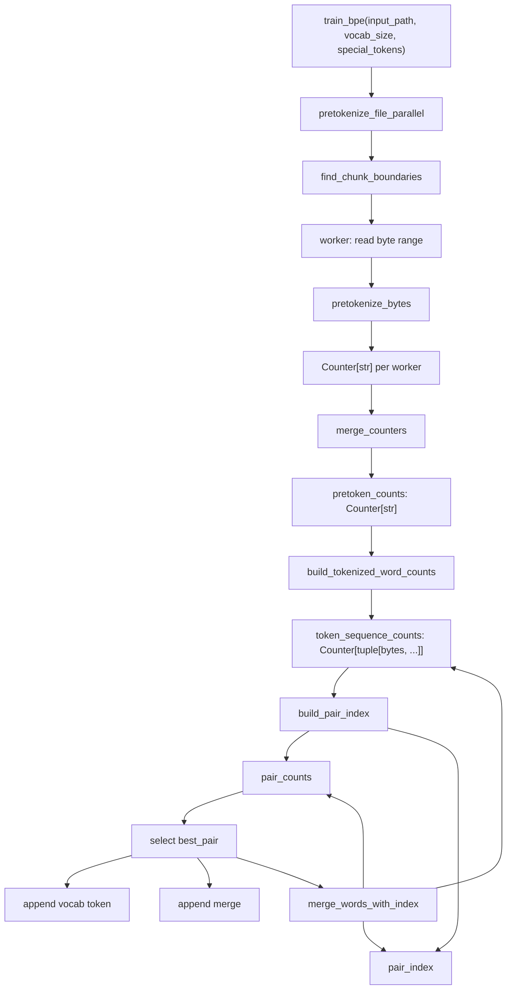

# Byte-Level BPE Tokenizer

This package implements byte-pair encoding (BPE) training and inference for
CS336 Assignment 1. Training and inference share the same pre-tokenization rule
and byte-level merge representation.

## Module Layout

- `train_bpe.py`
  - Validates the requested vocabulary size.
  - Runs file pre-tokenization.
  - Trains BPE from the resulting pretoken counts.
- `pretokenization.py`
  - Splits raw bytes around special tokens.
  - Applies the GPT-2 pre-tokenization regex.
  - Supports multiprocessing over file chunks separated by special-token
    boundaries.
- `bpe.py`
  - Builds the initial byte vocabulary.
  - Converts pretokens to byte-symbol tuples.
  - Maintains pair counts and an inverted index from pairs to affected token
    sequences.
  - Applies BPE merges deterministically.
- `tokenizer.py`
  - Encodes text with the learned merge order.
  - Preserves special tokens as individual vocabulary items.
  - Streams token IDs from text iterables and decodes IDs back to text.
  - Loads pickled vocabularies and merge lists.

## Training Data Flow



## Pre-Tokenization

`pretokenize_file_parallel` accepts the explicit `num_processes` keyword through
`train_bpe(..., num_processes=N)`. If omitted, it uses up to 8 local CPUs.

The parallel path:

- Encodes special tokens as bytes.
- Uses the longest special token as the chunk-boundary marker.
- Has each worker open the file, seek to its assigned byte range, and return a
  local `Counter[str]`.
- Merges worker counters in the parent process.

Fallbacks:

- `num_processes <= 1` runs single-process pre-tokenization.
- No special tokens runs single-process pre-tokenization, because arbitrary byte
  boundaries can change regex behavior at chunk edges.
- If chunk-boundary discovery collapses to one chunk, it also runs
  single-process pre-tokenization.

## BPE Training

The trainer starts from:

- `vocab`: all 256 single-byte tokens followed by special tokens.
- `token_sequence_counts`: `Counter[tuple[bytes, ...]]`, mapping each pretoken's
  byte-symbol sequence to its corpus frequency.
- `pair_counts`: weighted counts of adjacent byte-symbol pairs.
- `pair_index`: an inverted index from each pair to the set of token sequences
  that currently contain it.

Each merge iteration:

1. Selects the best pair by `(frequency, pair)`.
2. Appends the merged byte token to `vocab`.
3. Appends the selected pair to `merges`.
4. Rewrites only token sequences containing that pair.
5. Decrements old pair counts and increments new pair counts for those affected
   token sequences.

This avoids recomputing adjacent pair counts from all token sequences on every
merge.

## Key Data Structures

- `pretoken_counts`: `Counter[str]`
  - Maps each pretokenized string to its frequency in the corpus.
- `token_sequence_counts`: `Counter[tuple[bytes, ...]]`
  - Maps each byte-symbol sequence to its frequency.
- `pair_counts`: `Counter[tuple[bytes, bytes]]`
  - Maps each adjacent symbol pair to its weighted frequency.
- `pair_index`: `dict[tuple[bytes, bytes], set[tuple[bytes, ...]]]`
  - Tracks which token sequences must be rewritten when a pair is merged.
- `vocab`: `dict[int, bytes]`
  - Maps token IDs to token byte values.
- `merges`: `list[tuple[bytes, bytes]]`
  - Records BPE merges in training order.

## Tokenizer Inference

`BPETokenizer.encode` separates text into ordinary and special-token segments.
Ordinary text is split with the shared compiled `PRETOKEN_PATTERN`. Each pretoken
starts as UTF-8 bytes, then repeatedly applies the currently available merge
with the lowest training rank.

The tokenizer keeps a 256-entry LRU cache per instance for recently encoded
pretokens. The fixed cache size improves repeated-word encoding without making
`encode_iterable` memory usage grow with corpus size.

`decode` concatenates token bytes before UTF-8 decoding. This is required because
one Unicode character can span multiple byte-level tokens.

## Public API

Train a tokenizer vocabulary and merge list:

```python
from cs336_basics.tokenizer.train_bpe import train_bpe

vocab, merges = train_bpe(
    "data/TinyStoriesV2-GPT4-train.txt",
    vocab_size=10_000,
    special_tokens=["<|endoftext|>"],
    num_processes=8,
)
```

Encode, stream, and decode text:

```python
from cs336_basics.tokenizer.tokenizer import BPETokenizer

tokenizer = BPETokenizer(vocab, merges, special_tokens=["<|endoftext|>"])
token_ids = tokenizer.encode("Once upon a time<|endoftext|>")
text = tokenizer.decode(token_ids)

with open("data/TinyStoriesV2-GPT4-valid.txt") as corpus:
    token_count = sum(1 for _ in tokenizer.encode_iterable(corpus))
```

`BPETokenizer.from_files` expects `vocab` and `merges` serialized separately with
Python `pickle`. Pickle can execute code while loading, so only load artifacts
from trusted sources.

## Dataset Experiments

Train the tokenizer and encode the training and validation splits:

```bash
uv run python -m cs336_basics.tokenizer.train_bpe_tinystories --stage all --num-processes 8
uv run python -m cs336_basics.tokenizer.train_bpe_expts_owt --stage all --num-processes 8
```

Use `--stage train` and `--stage encode` to run the two phases separately. Both
entry points accept `--train-path`, `--validation-path`, and `--output-dir` for
server-specific paths.

Each experiment writes `vocab.pkl`, `merges.pkl`, an inspectable `vocab.json`,
`manifest.json`, and raw little-endian `uint16` arrays named `train_tokens.bin`
and `validation_tokens.bin`. Load an encoded split without copying it into memory:

```python
import numpy as np

train_ids = np.memmap("artifacts/tokenizer/tinystories_bpe_10k/train_tokens.bin", dtype="<u2", mode="r")
```

## Invariants

- BPE training operates on `bytes`, not Python Unicode characters.
- The initial vocabulary contains all 256 single-byte tokens.
- Special tokens are appended to the vocabulary and excluded from ordinary merge
  training.
- Each successful merge appends one new token to `vocab`.
- `merges` preserves the order in which pairs were selected.
- Pair selection is deterministic: highest frequency first, then
  lexicographically greatest pair.
- `pair_counts` and `pair_index` must stay consistent with
  `token_sequence_counts` after each incremental merge.
