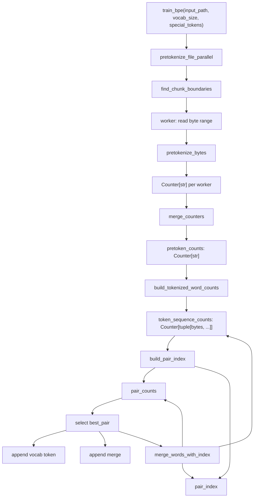

# 字节级 BPE Tokenizer

本包实现 CS336 Assignment 1 使用的字节级 BPE 训练和推理。训练和推理共用同一套预分词规则，并使用字节级 merge 表示。

## 模块结构

- `train_bpe.py`
  - 校验目标词表大小。
  - 对输入文件做预分词。
  - 基于预分词计数训练 BPE。
- `pretokenization.py`
  - 按 special token 切分原始字节。
  - 使用 GPT-2 风格正则做预分词。
  - 支持在 special-token 边界上切分文件并并行处理。
- `bpe.py`
  - 构造初始字节词表。
  - 将 pretoken 转换为字节符号序列。
  - 维护 pair 计数和 pair 到受影响 token 序列的倒排索引。
  - 确定性地应用 BPE merge。
- `tokenizer.py`
  - 使用学到的 merge 顺序编码文本。
  - 将 special token 保留为独立词表项。
  - 支持从文本迭代器流式编码 token ID，并支持解码回文本。
  - 支持加载 pickle 格式的 vocab 和 merges。

## 训练数据流



## 预分词

`pretokenize_file_parallel` 可以通过 `train_bpe(..., num_processes=N)` 显式指定进程数。如果不传，默认最多使用 8 个本地 CPU。

并行流程：

- 将 special token 编码为字节。
- 使用最长的 special token 作为文件切分边界标记。
- 每个 worker 打开文件，seek 到自己的字节范围，并返回本地 `Counter[str]`。
- 主进程合并各 worker 的计数。

降级路径：

- `num_processes <= 1` 时使用单进程预分词。
- 没有 special token 时使用单进程预分词，因为任意字节边界可能改变正则匹配行为。
- 如果边界发现最终只得到一个 chunk，也使用单进程预分词。

## BPE 训练

训练器从以下状态开始：

- `vocab`: 256 个单字节 token，后面追加 special token。
- `token_sequence_counts`: `Counter[tuple[bytes, ...]]`，记录每个 pretoken 的字节符号序列及其频次。
- `pair_counts`: 相邻字节符号 pair 的加权计数。
- `pair_index`: 从 pair 到当前包含该 pair 的 token 序列集合的倒排索引。

每次 merge 迭代：

1. 按 `(frequency, pair)` 选择最优 pair。
2. 将合并后的字节 token 追加到 `vocab`。
3. 将选中的 pair 追加到 `merges`。
4. 只重写包含该 pair 的 token 序列。
5. 对受影响序列递减旧 pair 计数，并递增新 pair 计数。

这样可以避免每次 merge 都从所有 token 序列重新计算相邻 pair 计数。

## 关键数据结构

- `pretoken_counts`: `Counter[str]`
  - pretoken 字符串到语料频次的映射。
- `token_sequence_counts`: `Counter[tuple[bytes, ...]]`
  - 字节符号序列到语料频次的映射。
- `pair_counts`: `Counter[tuple[bytes, bytes]]`
  - 相邻符号 pair 到加权频次的映射。
- `pair_index`: `dict[tuple[bytes, bytes], set[tuple[bytes, ...]]]`
  - 记录一个 pair 被合并时需要重写哪些 token 序列。
- `vocab`: `dict[int, bytes]`
  - token ID 到 token 字节值的映射。
- `merges`: `list[tuple[bytes, bytes]]`
  - 按训练顺序记录 BPE merges。

## Tokenizer 推理

`BPETokenizer.encode` 会把文本切分为普通文本片段和 special-token 片段。普通文本使用共享的 `PRETOKEN_PATTERN` 预分词。每个 pretoken 先变成 UTF-8 字节，然后反复应用当前可用且训练 rank 最小的 merge。

每个 tokenizer 实例对最近编码的 pretokens 保留一个大小为 256 的 LRU cache。固定 cache 大小可以提升重复词编码速度，同时避免 `encode_iterable` 的内存使用随语料规模增长。

`decode` 会先拼接 token 字节，再做 UTF-8 解码。这是必须的，因为一个 Unicode 字符可能跨多个字节级 token。

## 公共 API

训练 tokenizer 词表和 merge 列表：

```python
from cs336_basics.tokenizer.train_bpe import train_bpe

vocab, merges = train_bpe(
    "data/TinyStoriesV2-GPT4-train.txt",
    vocab_size=10_000,
    special_tokens=["<|endoftext|>"],
    num_processes=8,
)
```

编码、流式编码和解码文本：

```python
from cs336_basics.tokenizer.tokenizer import BPETokenizer

tokenizer = BPETokenizer(vocab, merges, special_tokens=["<|endoftext|>"])
token_ids = tokenizer.encode("Once upon a time<|endoftext|>")
text = tokenizer.decode(token_ids)

with open("data/TinyStoriesV2-GPT4-valid.txt") as corpus:
    token_count = sum(1 for _ in tokenizer.encode_iterable(corpus))
```

`BPETokenizer.from_files` 期望 vocab 和 merges 分别用 Python `pickle` 序列化。pickle 加载时可能执行代码，因此只应加载可信来源的文件。

## 数据集实验

训练 tokenizer 并编码训练集和验证集：

```bash
uv run python -m cs336_basics.tokenizer.train_bpe_tinystories --stage all --num-processes 8
uv run python -m cs336_basics.tokenizer.train_bpe_expts_owt --stage all --num-processes 8
```

使用 `--stage train` 和 `--stage encode` 可以分阶段运行。两个入口都支持 `--train-path`、`--validation-path` 和 `--output-dir`，方便在不同机器上指定路径。

每个实验会写出 `vocab.pkl`、`merges.pkl`、可检查的 `vocab.json`、`manifest.json`，以及名为 `train_tokens.bin` 和 `validation_tokens.bin` 的 raw little-endian `uint16` 数组。无需复制到内存即可加载编码后的 split：

```python
import numpy as np

train_ids = np.memmap("artifacts/tokenizer/tinystories_bpe_10k/train_tokens.bin", dtype="<u2", mode="r")
```

## 不变量

- BPE 训练操作对象是 `bytes`，不是 Python Unicode 字符。
- 初始词表包含全部 256 个单字节 token。
- Special token 会追加到词表，并排除在普通 merge 训练之外。
- 每次成功 merge 都会向 `vocab` 追加一个新 token。
- `merges` 保留 pair 被选择的顺序。
- Pair 选择是确定性的：先比较频次，频次相同则选择字典序更大的 pair。
- 每次增量 merge 后，`pair_counts` 和 `pair_index` 必须与 `token_sequence_counts` 保持一致。
